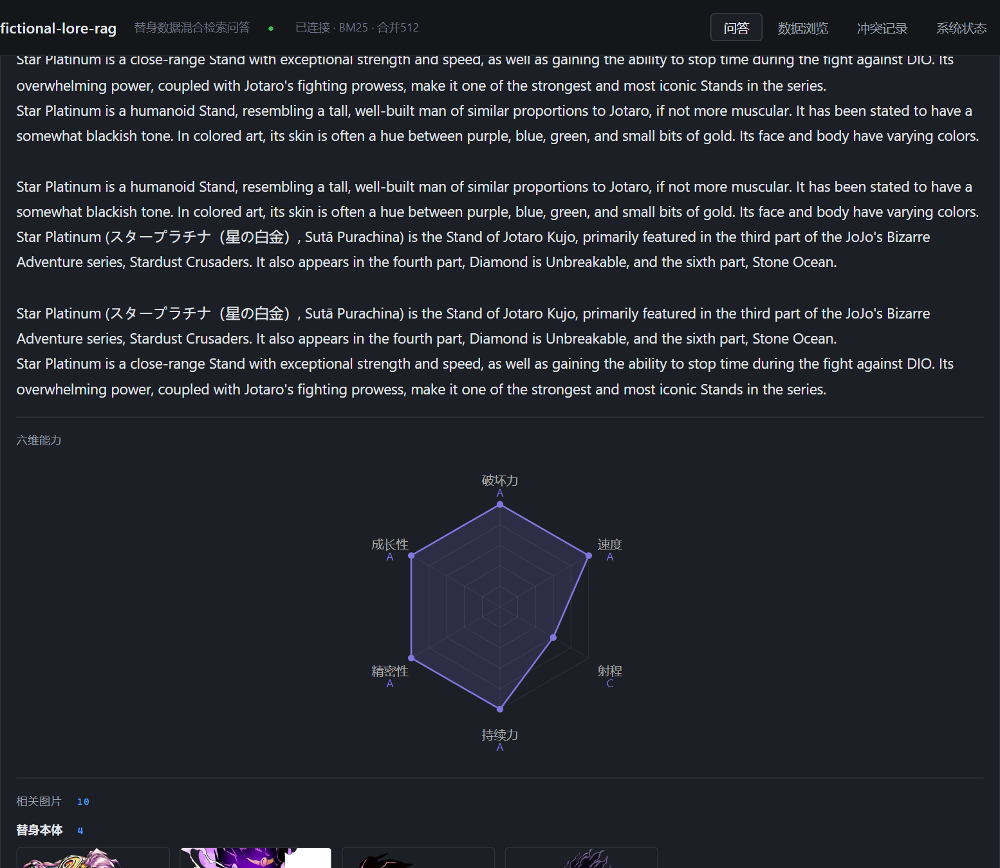
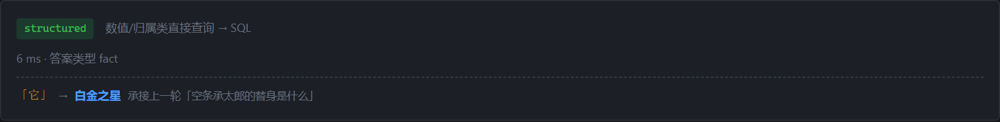
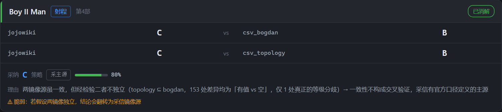

# fictional-lore-rag

[](https://github.com/yeezus-simplicity/fictional-lore-rag/actions/workflows/tests.yml)

> **JoJo 替身数据混合检索系统** —— 从多源数据清洗到生成式问答的完整链路
> 156 替身 / 144 角色 / 2407 文本块 / 混合检索 +18.5% / 证据有效性 88.1pp

一个把「数据质量 → 检索 → 路由 → 冲突消解 → 生成评测」串起来的可运行系统。
**最有价值的产出不是那些数字，而是三个可迁移的方法论发现**（见下文「三个发现」）。



*问「白金之星的六维能力」：走结构化查询 6ms 返回，附带六维雷达图与替身图片
（缺失维度不填 0，连线断开并标注「无数据」）。*

---

## 快速开始

```bash
git clone https://github.com/yeezus-simplicity/fictional-lore-rag.git
cd fictional-lore-rag

# 1) 依赖（务必指定官方源）+ 模型（约 7.3 GB，必须自己下）
pip install -i https://pypi.org/simple -r requirements.txt
python retrieval/fetch_model.py --repo BAAI/bge-m3

# 2) 启动（自动避开被占端口、自动开浏览器）
python start.py                        # 或双击 start.bat
# 打开 http://127.0.0.1:8765

# 3) 可选：起数据库（结构化查询 / 数据浏览 / 冲突记录）
cd docker && docker compose up -d postgres && cd ..
python database/load_db.py --all
python services/apply_resolutions.py
#  ★ 不起也能跑 —— 会自动降级为「仅语义检索」，语义问答完全可用
#  ★ 第 2 条别漏：它把冲突消解结果写进 resolution_log，
#    而 /conflicts 的「采纳理由 / 置信度 / 敏感性」都来自那张表。
#    只跑 load_db 的话，冲突记录页会缺这三项（接口不会报错，是静默变空）。

# 4) 跑评测
python evaluation/run_faithfulness_eval.py        # 忠实度四配置对照
python evaluation/run_chunk_quality_eval.py       # 块大小 × 生成质量

# 5) 指标自检（★ 简历上的每个数字都在这里校验）
python evaluation/collect_metrics.py --check
```

### ★ 重建原文语料（clone 后必须做一次）

仓库**不包含**抓取到的第三方原文与体积大的中间产物（版权 / 体积原因）：

| 缺失内容 | 是什么 | 重建方式 |
|---|---|---|
| `dataset/sources/rendered/` | 渲染后的详情页 JSON（**切块的输入**） | 渲染抓取（见下） |
| `dataset/processed/text_chunks.json` | 2407 个文本块（**检索语料**） | 同上，自动切块 |
| `models/` | bge-m3 等权重（约 7.3 GB） | `retrieval/fetch_model.py` |
| `index/` | embedding 缓存（199 MB） | **自动生成**，无需手动 |

★ **已提交的结构化数据不用重抓**（`stands.json` / `details.json` /
`stand_stats.json` / 两个 CSV 都在仓库里），所以**不要加 `--refetch`**
——那会重新抓 154 个详情页、白等约 10 分钟。

```bash
# 1) 渲染抓取依赖（只做一次）：需要 Node.js 18+
cd tools && npm install && npx playwright install chromium && cd ..

# 2) 模型权重（不入库，必须自己下）
python retrieval/fetch_model.py --repo BAAI/bge-m3

# 3) 重建语料 —— 会检测到 rendered/ 为空，自动触发渲染抓取
python dataset/pipeline/run_pipeline.py
```

★ 第 3 步走完「静态抓取 → 渲染抓取 → 切块 → 编码 → 合并 → 校验」全流程；
  若只想手动只抓渲染页，可单独用 `tools/render_fetch.js`（见 `tools/README.md`）。
★ 抓取需要外网，且请自行遵守来源站点（jojowiki / 中文维基）的使用条款。
★ 本项目仅用于技术演示，第三方内容版权归荒木飞吕彦 / 集英社所有。

---

## 测试与 CI

CI（GitHub Actions）在每次 push / PR 时跑 8 套回归测试，**不需要下载 7 GB 模型**：

| 层 | 内容 |
|---|---|
| 静态 | `compileall` 全量语法检查 |
| 接口 | 别名与相关性 / 角色归属 / 中文名 / 多轮追问 |
| 界面 | 冲突消解卡 / 多轮追问 UI / 端到端主流程（Playwright） |
| 降级 | DB 不可用时的优雅降级（用 `PGPORT=1` 强制制造） |

两个关键设计：

- **跳过 torch**：CI 只装 `requirements-ci.txt`（服务层 + 数据层），
  所有测试以 `--no-vector` 启动（纯 BM25）。
  ★ 这反过来印证了「向量检索是可选增强，不是必需路径」。
- **合成语料**：真实语料（2407 块描述原文）因版权不入库，
  CI 里用 `evaluation/make_min_fixture.py` 从**仓库已有的结构化数据**
  现场合成一份最小语料（165 块），足够让服务启动并支撑流程测试。

本地复现 CI：

```bash
python evaluation/make_min_fixture.py     # 合成语料
python evaluation/test_m25_multiturn.py   # 任选一个测试
```

> ★ 合成语料**只能验证流程**，不能用于评测检索质量
> （它不含描述原文）。真实评测请先按上文重建语料。

### 改 schema 后请跑这个

```bash
python evaluation/check_fresh_deploy.py            # 完整自检
python evaluation/check_fresh_deploy.py --static   # 只做静态检查（秒级）
```

它回答的问题是「**别人 clone 后能不能跑起来**」——
而不是「我这台机器上能不能跑」（后者容易得多，也骗过我好几次）：

| 步骤 | 查什么 |
|---|---|
| 静态检查 | 代码里 `FROM/JOIN` 引用的表，是否都在 schema 中有定义 |
| 建空库 | 从 `DROP/CREATE DATABASE` 开始，绝不复用已有库 |
| 加载链 | `load_db --all` → `apply_resolutions`，全连这个空库 |
| 接口探测 | 起服务连空库，确认 `/conflicts` 等**真的有数据**（不只是 200） |

★ 为什么需要它：项目里曾经有三处缺陷**只在全新环境暴露** ——
合成语料用了 schema 不允许的枚举值、`load_db` 把语料行数写死、
以及 `resolution_log` 表**只由脚本运行时创建、schema 里根本没有**
（导致 `/conflicts` 在全新部署时直接 500）。
它们在本机全都跑得好好的。这个脚本就是把那次排查固化下来。

**完整环境说明见 [docs/数据准备.md](docs/数据准备.md)** ——
含「仓库里有什么/没有什么」「已知会踩的坑」「完整验证清单」。

> ★ **只想快速看一眼？** 跳过模型下载，直接
> `python api/main.py --port 8765 --no-vector` —— 纯 BM25 检索，秒级启动，
> 网页界面、语义问答、拒答都能用。

---

## 系统架构

```
问句
 │
 ├─► M25 指代消解（多轮）★ 在路由之前
 │     带 session_id 时，把「它 / 这个替身 / 他」换成上一轮实体
 │     —— 下游完全无感知
 │
 ├─► M4 意图路由（4 类，可解释）
 │     structured ─► SQL 执行器（M5 抽取式，零生成）
 │     semantic   ─► M3 混合检索（BM25 + bge-m3 + RRF k=30）
 │     hybrid     ─► 两者结合
 │     abstain    ─► 拒答 + 理由（编造实体检测）
 │
 └─► 答案 + 证据（可追溯到表/字段或 chunk_id）+ 可靠性警告

M6 生成层：Qwen2.5-1.5B + 忠实度约束的 system prompt
M4 消解层：28 条源间冲突落表，4 种策略 + 敏感性分析
```

### 多轮追问（M25）

```bash
# 同一个 session_id 串起一轮对话
curl -X POST "localhost:8765/query?q=空条承太郎的替身是什么&session_id=demo"
curl -X POST "localhost:8765/query?q=那它的速度呢&session_id=demo"
#   ↑ 响应里的 coref 字段会告诉你：{"pronoun":"它","resolved_to":"白金之星"}
```

界面上的「新对话」按钮 = 换一个 session_id = 清空上下文。



*第二轮问「那它的速度呢」，顶栏显示系统把「它」解析成了**白金之星**，
并标注承接自哪一轮 —— 让用户看得见系统的理解，答错时才知道错在哪一环。*

★ 两个容易做错的地方（都实测踩过）：
1. **中文代词要排除伪代词** —— `其他`/`其中`/`尤其` 含 `他`/`其`，
   不排除会把「其他替身有哪些」替换成病句。
2. **本轮自带实体时不能替换** —— 「白金之星的射程呢」自己说了实体，
   被上一轮覆盖就答错了。

### 为什么答案是英文？以及怎么处理的

**不是 bug**：语料 2407 块**全部来自 jojowiki 英文站**，
所以语义检索返回的自然是英文原文。

★ 我们**没有**用机器翻译把它变中文 —— 那会破坏「证据可追溯」，
而后者正是这个项目 88.1pp 证据有效性的根基。改用的办法是
**用本来就有的中文数据拼一张「替身档案」卡**，放在英文原文之前：

```
替身档案            名称  白金之星  Star Platinum · スタープラチナ
（中文信息）        使用者  Jotaro Kujo
                   登场   第 3 部
                   类型   近距离型 · 自然人型
                   六维   破坏力 A · 速度 A · 射程 C · 持续力 A …
```

英文原文**默认收起**，想看原始出处的点一下展开。

### 多语言查询

替身名支持**中文 / 日文原名 / 罗马字 / 英文**四种写法：

```
白金之星的破坏力        →  A
スタープラチナの破壊力   →  A      ← 全日文，此前会被拒答
白金之星的破壞力        →  A      ← 繁体
Star Platinum 的破坏力  →  A
```

> 修这个时发现两处「只认简体」的缺口：实体匹配的字符集漏了
> 片假名（`\u3040-\u30ff`），维度词表只有简体（不认「破壊力」「破壞力」）。
> 前者让日文名压根进不了候选，后者让全日文问句被判成「无领域信号」而拒答。

### 相似替身推荐

```
GET /similar/star_platinum?k=5
```

★ 用**六维数值距离**，不用向量索引：后者要 7 GB 模型，
而且编码的是「描述文本」的语义，不是「能力数值」。

★ 缺失维度**不按 0 计**：只比两边都有值的维度，共同维度少于 3 个
就不参与比较，并**明说排除了多少个**（六维完整度 79.87%）。

★ 返回值带 `scope` 字段说明「按六维数值排序，**不代表设定相似**」——
实测 Star Platinum 的最近邻里就有 D4C（六维完全相同，
但一个能时间停止、一个是平行世界）。这点在演示时必须讲清楚。

---

## 核心指标

| 阶段 | 指标 | 数值 | 来源 |
|---|---|---|---|
| **M1 数据层** | 替身 / 形态 / 文本块 | 154 / 146 / 2407 | `stands.json` |
| | 六维完整度 | 79.87% | `stand_stats.json` |
| | 源间冲突 | 28 条（待消解 16） | `conflicts.json` |
| **M2 评测** | 评测集 | 176 条 / 7 类题型 | `eval_set.json` |
| | **LLM 依赖** | **零**（程序化推导 gold） | — |
| **M3 检索** | recall@5 | 0.5272 → **0.625**（+18.5%） | `m3_best.json` |
| | nDCG@5 | 0.3371 → **0.4078**（+21.0%） | 同上 |
| **M4 消解路由** | 路由准确率 | 0.8352 → **1.0** | `m4_results.json` |
| | 混合意图 / 拒答 | 0.0→1.0 / 0.6→1.0 | 同上 |
| **M5 服务** | 端点 / 验证 | 5 个 / 12 项全通过 | 提交 `9258c38` |
| **M6 生成** | **证据有效性** | **88.1pp** | `m6_faithfulness.json` |
| | 指标敏感度 | 80.6pp | 同上 |
| **M7 块大小** | 推荐块长 | 512（权衡分析后） | `m7_chunk_quality.json` |

★ **注意 M3 有两个基准**：+18.5% 是 vs M2 原始默认参数，
vs 仅 BM25 调参是 +5.4pp。**不可混用。**

---

## ★ 三个可迁移的发现

> 数据可以再跑，**发现不会**。这三个是本项目最有价值的产出。

### 发现 1：多源交叉验证的前提是**源相互独立**

调查某数据分歧时发现，两个「镜像源」实为**子集关系**
（154 个共同条目仅 1 处真正数值分歧）。
**两个源一致是同源复制的必然结果，不构成交叉验证。**

判定方法：看「只有 A 有的条目数」与「只有 B 有的条目数」，
若一方为 0 而另一方 > 0 → 子集关系，不独立。

→ 据此判定原有 `prefer_consensus` 策略失效，改为`prefer_primary`。



*这条论证**在界面上可直接查证**：「冲突记录」页每条冲突都给出采纳值、
策略、置信度、**采纳理由**与**敏感性** —— 上图那条的敏感性标注是
「⚠ 脆弱：若假设两镜像源独立，结论会翻转为采信镜像源」，
即**结论依赖于一个可检验的假设**，而不是拍脑袋定的。*

「保留未知」的 16 条不是失败，而是**刻意的决策**（不臆测），
界面单独标出并显示理由。

### 发现 2：**任何单一指标都必然偏向一方**

M3 用的检索指标**系统性偏好大块**（2048 时全1.0），
而我第一版用的「证据利用率」**系统性偏好小块**（256 时最优）。
两者是**镜像偏差**，各自只测了一个维度。

| 决策 | 指标偏向 | 该同时看 |
|---|---|---|
| 块大小 | 大 / 小 | 信息量 + 精炼度 + 代价 |
| 检索重排 | 召回 / 精度 | gold 定义 + 首位命中 + 延迟 |
| 消解策略 | 置信度 / 保守性 | 敏感性分析 + 可用比例 |

→ 判断指标是否可用：**看它的最优解是否随口径翻转**。

### 发现 3：装置缺陷会**伪装成实验结果**

三次把「结果异常」追溯成「装置不对」：

| 现象 | 真实原因 |
|---|---|
| 重排**变差** −17% | gold 只认单块，而重排正确地返回了同替身其他块 |
| 块大时**全1.0** | 检索指标测不出块大小的影响 |
| 某指标**恒为 0** | 题型不匹配（描述类问题没有数值断言） |

→ **跑实验前先问「这套装置能不能测出目标效应」**，而不是先跑再看结果。

---

## 文档导航

| 文档 | 内容 | 适合谁 |
|---|---|---|
| [docs/简历素材.md](docs/简历素材.md) | ★ bullet + 数字溯源 + 讲解脚本 | 投递 / 面试 |
| [docs/进度.md](docs/进度.md) | ★ 里程碑状态与编号对照 | 快速了解全貌 |
| [docs/评测设计复盘.md](docs/评测设计复盘.md) | 两次「指标与目标脱钩」的排查 | 想学方法论 |
| [docs/M6生成层报告.md](docs/M6生成层报告.md) | 忠实度四配置 + 11 轮指标修错 | 想看评测怎么设计 |
| [docs/M7块大小实验报告.md](docs/M7块大小实验报告.md) | ★「单指标必然偏向」的论证 | 想学指标设计 |
| [docs/过程记录/](docs/过程记录/) | 走错的路（不读主线时不用看） | 深度挖掘 |
| [docs/README.md](docs/README.md) | 全部文档索引 | 找特定内容 |

---

## 数据来源与合规

- 数据源：jojowiki（主源）+ 2 个第三方 CSV 镜像
- 用途：技术研究与学习
- ★ 冲突**不静默覆盖**：`raw` / `cat` / 消解结果三者并存，
  异常值（如 `?` / `∞`）在 API 响应里显式警告

---

## 已知局限

| 局限 | 说明 |
|---|---|
| 六维完整度 79.87% | 20% 的替身有维度未知（数据源本身的不确定性） |
| 路由满分 = 评测集饱和 | 问句程序化生成，真实输入更口语化 |
| 1.5B 生成模型 | 绝对值不代表 SOTA，仅用于验证链路 |
| M7 样本量 24 题 | 结论方向可靠，具体值置信区间较宽 |

---

*7062 字节的指标数据由 `collect_metrics.py` 自动汇总，非手抄*
